# Vacuum Cannon

# Description
The premise of our experiment is to measure the velocity of a ping pong ball within a pumpless vacuum cannon based on [NightHawkInLight's work on Instructables.](https://www.instructables.com/Rapid-Reload-Vacuum-Cannon-Magnetic-Piston-No-Burs/) To obtain our position and time data, and by extension velocity data, we use a high-speed camera.

There is some evidence that suggests that these projectiles can reach speeds greater than models predict. We set out to build a robust dataset by measuring the near-instantaneous velocity of the ball while it's still accelerating within the barrel. This requires replication and modification, hopefully that can shed more light on whether these models correctly predict the limit of projectile velocity.

[Link to our project canvas](https://git.science.uu.nl/ued2023/ued2023/-/blob/main/projects/VacuumCannon_MantasMatthijsTrey/project_canvas_MantasTreyMatthijs.md?ref_type=heads)

# Visuals
Here's a .gif of our first test shot:

Shot captured with High-speed camera:

Here is the inventor/designer's own cannon in action: https://www.youtube.com/watch?v=0DKWSXstXuc

# Installation
We used NighHawkInLight's [Instructables](https://www.instructables.com/Rapid-Reload-Vacuum-Cannon-Magnetic-Piston-No-Burs/) and [video](https://youtu.be/0DKWSXstXuc?si=jWNSEmHO73-EYwSq) as a guide for our design. We were very lucky to find a 1.82m by ≈40mm internal diameter tube laying around the shop to use as our barrel, a ≈40mm diameter PVC cylinder, and wood for mounting hardware to craft our cannon. We'd like to give a huge shout-out to [Lili's Proto Lab](https://lilis-protolab.sites.uu.nl/) for supplying us with the  materials, tools, and access to skilled technicians because none of this could have happened without [LPL](https://lilis-protolab.sites.uu.nl/).

# Safety
$`\textcolor{red}{\text{This is dangerous.}}`$

$`\textcolor{red}{\text{The projectile will cause harm if shot into someone or something.}}`$

$`\textcolor{red}{\text{Please be careful to point it away from any people and valuables.}}`$

$`\textcolor{red}{\text{Ensure that you have installed the bag to catch the ball at the end to avoid injury and/or damaging school property.}}`$

$`\textcolor{red}{\text{Be safe.}}`$

## Ingredients
### Software:
- [Tracker](https://physlets.org/tracker/)
- Custom python script to analyze the data

### Hardware \(Found in LPL box labeled "Trey"\):
#### Cannon
- Ping-pong balls. We needed 38mm orange balls so they would travel through our non-precision tubing smoothly and be easily tracked.
- 1.82m long, Ø≈40mm clear tubing for the barrel of the cannon. We used acrylic, but based on the short lifespan of the 5mm tube, we recommend trying other materials.
- Table or board long enough to mount your barrel securely. We used a long and narrow board so it can be stored on shelving when not in use and clamped down to a table for use.
- Wood, plastic, or a sturdy material to mount your barrel to the board/table. We used scrap plywood.
- Metal tabs to prevent the barrel from sliding out of the mounts when pulling the vacuum.
- Plastic or wood cylinder that's softer than your tube so it won't scratch it inside, ruining the seal. We used a scrap PVC cylinder, turned on the lathe to seal in the tube without getting stuck.
- O-ring(s) for sealing the piston in the tube.
- Lubricant to maintain a seal whilst maintaining piston mobility. We used Kruipolie.
- A rope, hook or clip, and eyelet screw to pull the piston back, while allowing the rope to detach for reloading.
- A target or 'beam dump' to catch the ball and prevent damaging objects or injuring others. We used a canvas bag.
- A spool to wind the rope on. We used a partially disassembled boat winch so it didn't have any gearing, but could hold the load.
- A drill to turn the spool fast enough that the piston is pulled back, 'creating' the vacuum as quickly as possible.

#### Camera 
- [Chronos 1.4 monochrome 8GB running software build 0.7.02 high-speed camera](https://www.krontech.ca/product/chronos-1-4-high-speed-camera/)
- Schneider-kreuznach Onyx 0.95/25 C high-speed lens
##### Camera Calibration
- 20mHz or better function generator set to square wave, 900Hz
- BNC to alligator cable
- LED to flash at the camera

#### Lighting
- Halogen Floodlights for backlighting the shot for maximum contrast.
- A sheet of opaque plastic used as a diffuser to spread the light over the length of the cannon better.

## Recipe
### Setup
- Place the cannon on a table $`\textcolor{red}{\text{pointed away from people.}}`$
- Pick up the opaque sheet and place it to diffuse the light.
- Put the lights behind the sheet (setup shown in the photo below).
- $`\textcolor{red}{\text{KEEP LIGHTS ON ONLY FOR SHORT PERIODS OF TIME!!!}}`$ as they will heat the tube up until the piston cannot be pulled through.
 
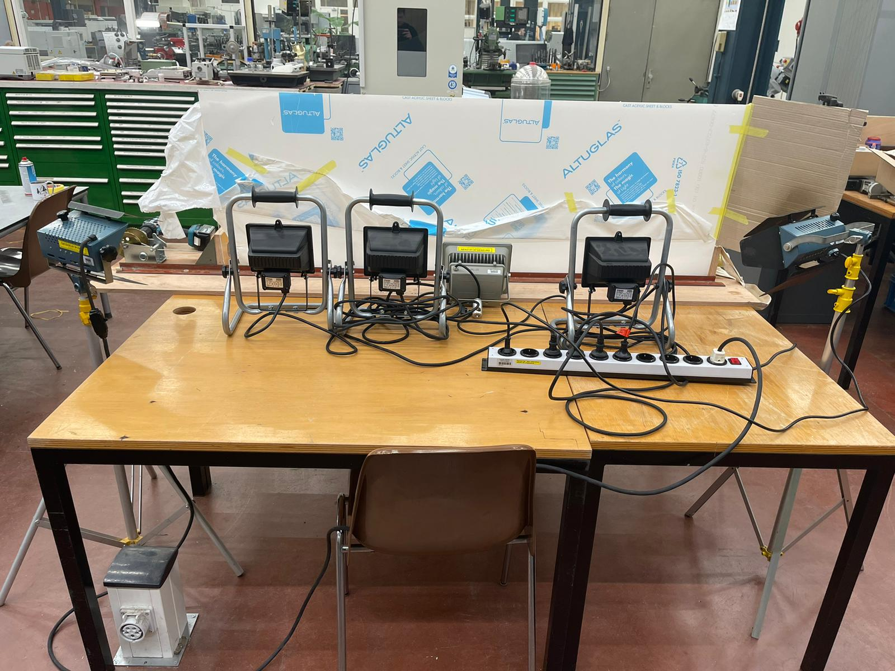

- Spray the insides of the tube with generous amounts of penetrating oil for the best seal (shown in the picture).

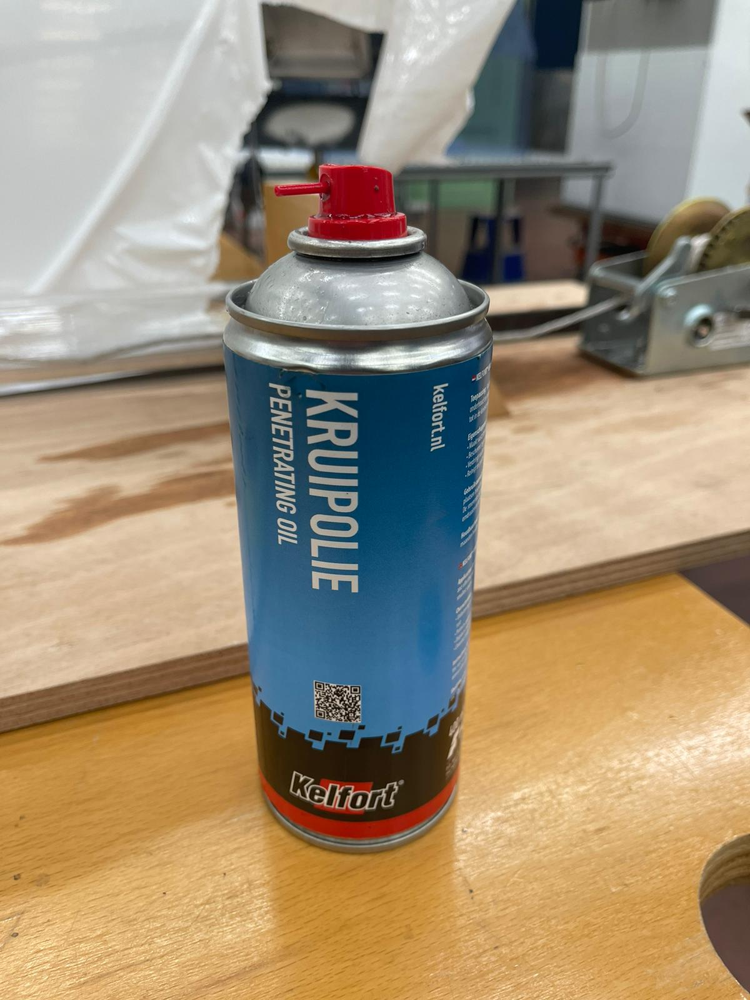

- Follow the instructions shown in the video in order to prepare the cannon for firing.

- Unspool and tow the line using the magnets stuck to the winch or support rail.
- Attach the piston to the line and place it in the tube
- Firmly place the ball on the sticky end of the piston and slowly pull on the line or turn the winch until the ball is just inside the end of the cannon. The closer to the end the ball is the stronger the vacuum will be.

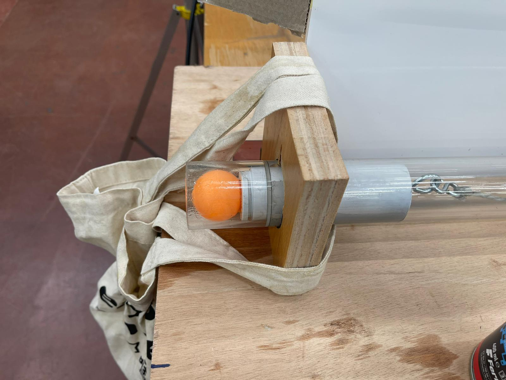

- Ensure that the line feeds to the top of the winch's drum:

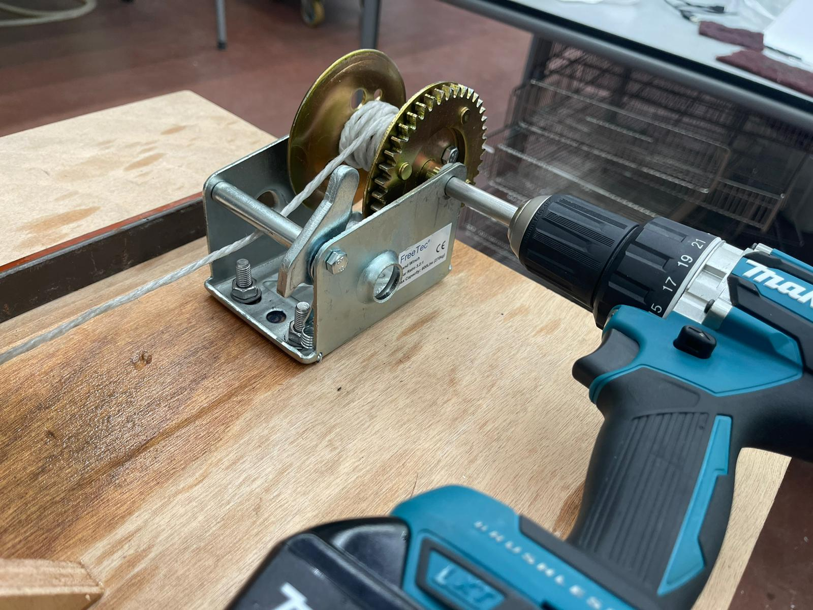

- Make the burst seal as shown in the video, the grease used is in the picture below.

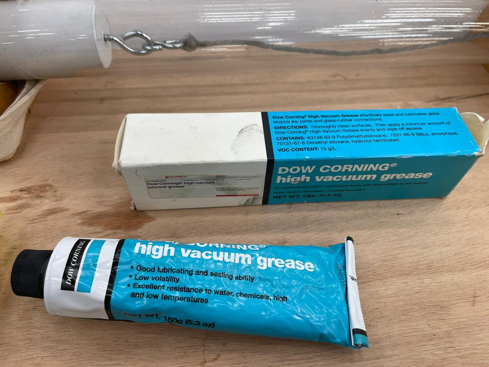

- Place the bag on the end of the cannon and ziptie it (to undo the ziptie follow the Tutorial video, place a flat screwdriver where the ziptie is locked and undo it)

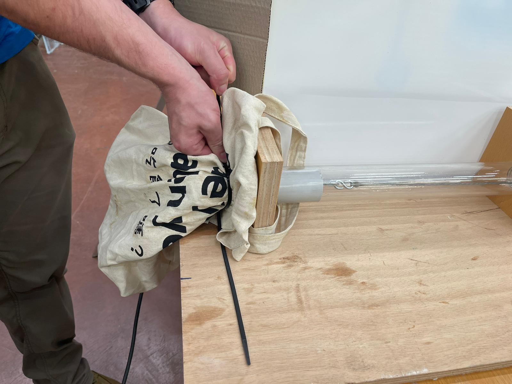

- Connect the drill to the winch, ensuring the chuck is nice and tight so the winch won't slip while the drill turns.

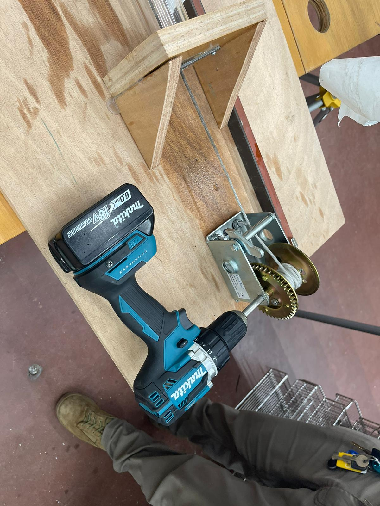

- Ensure the drill is in 'drilling mode' as shown:

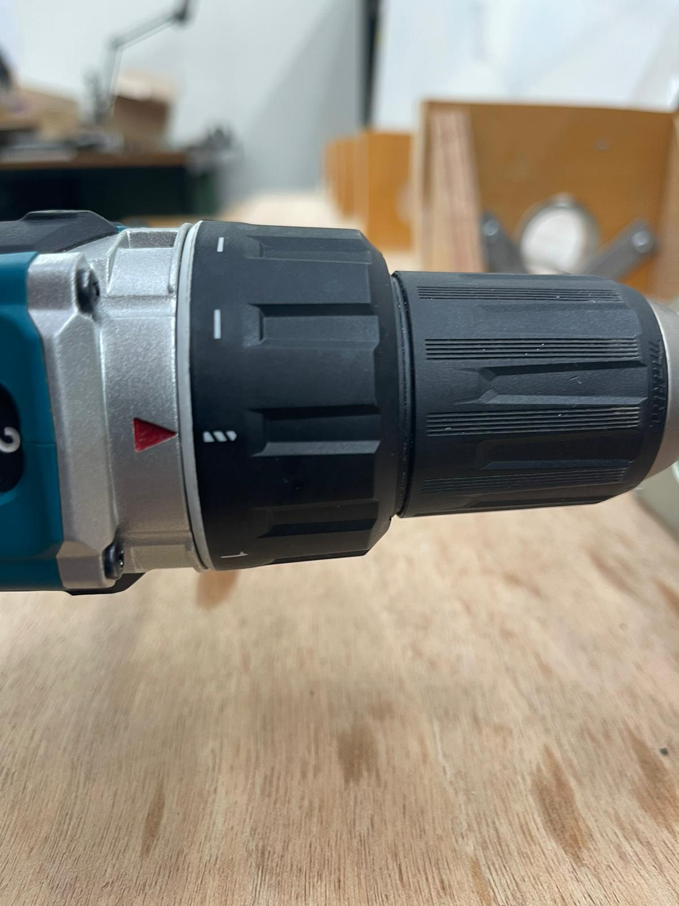

- Place the camera on a tripod or platform approximately level with the cannon so it can see the entire length of the tube. Filming less than the entire length will result in less data.

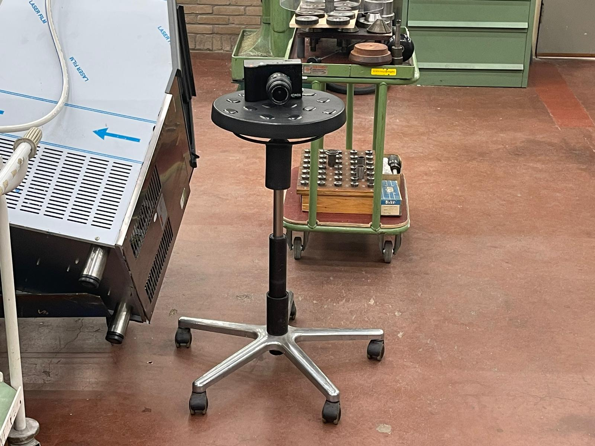
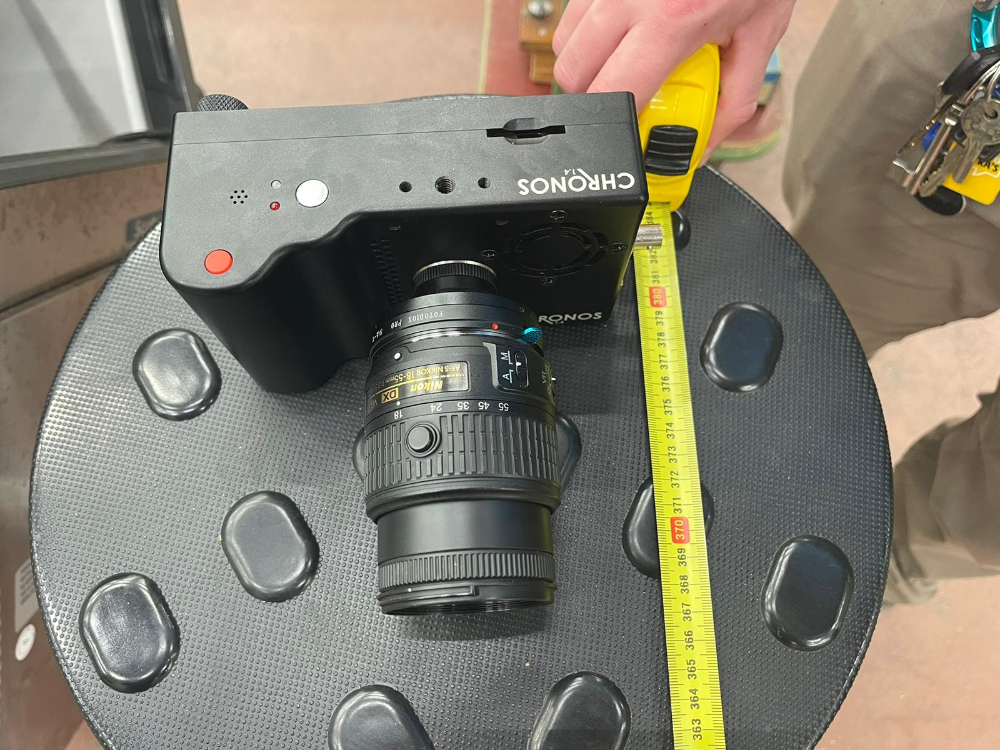

### Camera

- Set your camera up to capture the whole length of the barrel. For us that was a few metres away.
- Make sure you have set it to a high enough frame rate to capture the movement of the ball, we used approximately 9,000 fps, but would have gone higher if we had the capability.

### Firing procedure

- **CLEAR THE AREA BEFORE FIRING.** It *will* scare people.
- Check that the drill will rotate clockwise with a quick squeeze of the trigger.
- Ensure the camera is on.
- Turn on the lights.
- Ensure the camera sees what you want (you can focus the lens and change the aperture (how much light it gets)).
- Warn people that you are firing.
- Press the camera's record button.
- Hold the drill's trigger down and enjoy.

$`\textcolor{red}{\text{Bang!!!}}`$

- Quickly stop the recording, the camera will fill the RAM in seconds
- Turn off the lights
- Transfer the video to the computer for analysis

### Software
- Download [Tracker](https://physlets.org/tracker/) from: https://physlets.org/tracker/

Tracker is a free, open-source (GNU GPL3) video analysis software by Douglas Brown, Wolfgang Christian, and Robert M Hanson. 

It works using FDM, the finite difference method for velocity is defined in the program as v[i] = (x[i+1] - x[i-1]) / (2*dt). So it finds the mean velocity using 2 position steps.

#### Software instructions
- Open Tracker
- Upload the video on Tracker by selecting Open File Chooser and navigating to the file.

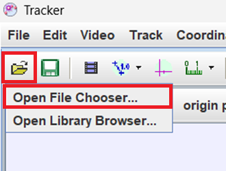

- Move the slider to the frame where the ball enters the image, select Set start frame to the slider, then similarly set end frame to the frame ball leaves the frame of the video.

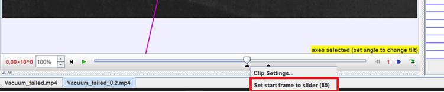

- Select Calibration Stick

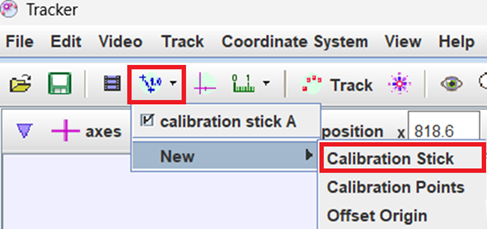

- Drag the ends of the calibration stick to a known length on the experiment setup and enter the length on the calibration stick in meters.
- Select Track -> New -> Point Mass, then edit the mass to 0.0027g.

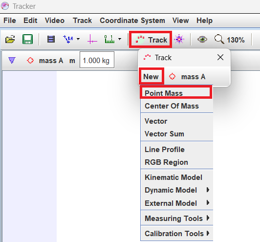

- In the frame where the ball is visible press Shift + Ctrl + Left click (on the approximate centre of the ball). A window will pop out. Select Search (This will search for your selected object in the selected range of frames)

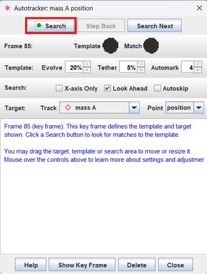

- The software may miss the ball, the marks then need to be dragged to where the ball is in that frame (select the frame you want with the slider) if the ball is not detected at all Shift + Ctrl + Left click on its location.
- A table will appear in the lower right corner, select Columns and check column "v" to see the velocity.

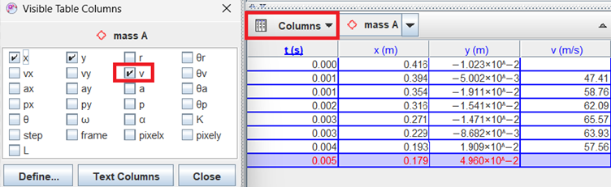

- If you see any time values that are the same in the table, right-click on the table and press on formats.

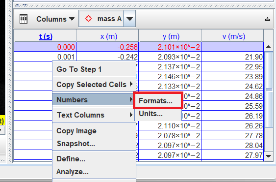

- It will open the window shown below, make sure the time value is selected as shown and change the Format to 0.000 add as many zeros after the decimal point as needed to make time values in the table different (the table updates real-time so it is not difficult to tell how many are needed).

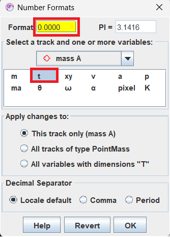

- Export the data:

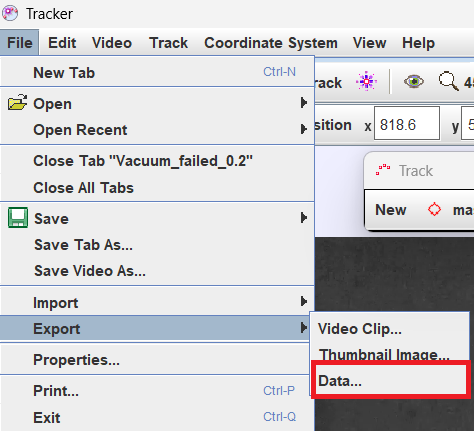

- Select columns and thick boxes that are selected in the picture: 

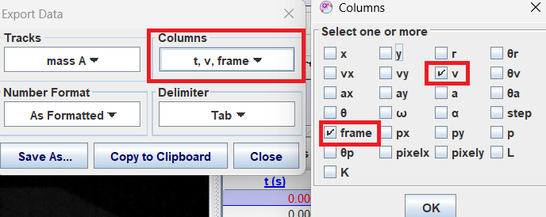

- Change the delimiter to "comma".

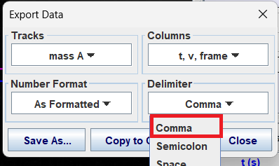

- Finish it by clicking Save As… and saving it as .txt.

Python analysis. 
- Drop the data file into the folder with the [Python code](https://git.science.uu.nl/ued2023/ued2023/-/blob/mantas/projects/VacuumCannon_MantasMatthijsTrey/Data_analysis.py) provided in GitLab. 
- Change the txt variable with the name of the data file.
- Run the code and the .png format files should be deposited in the code folder with the plots for Velocity vs time and Velocity vs frames.

# Camera Calibration
To confirm the frame rate of the camera we filmed an LED flashing at 900Hz and compared the time per frame according to the camera and the duration of a frame based on the LED pulses.
We filmed 1000 frames of the 900 Hz LED pulses, and manually counted the frames the LED was on and off to see if it was on for 5 and off for 5 frames, which is consistent within 0.06% with the camera's timestamps and 8985 fps setting.

# Results
## Data

We obtained some data from a misfire and analyzed it, the results are in this folder [Data](Data/Vx_data/) it contains all our data collected and graphs, Videos can be found [Here](Data/)

- Velocity as a function of distance.

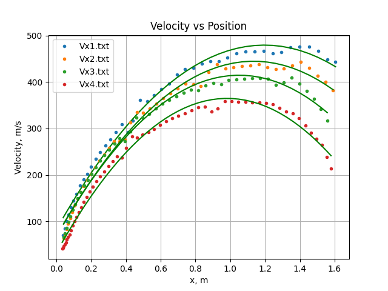

- Videos of the shots

   

Unfortunately, our vacuum tube broke after only 4 successful data-taking fires, cracking under the pressure difference. Although this was a massive disappointment, our 4 successful attempts showed the clear pattern that we expected. The projectile speed increased asymptotically towards a maximum velocity. However, this velocity seemed to be significantly above the speed of sound, which was considered to be the upper bound of what was possible for this kind of system. We also saw a significant drop in velocity towards the end of the tube, which we expect to be blowby of air around our projectile, which can never perfectly seal itself in the tube.

# Conclusions 

Given our limited data due to the cannon’s barrel failure, our last shots of the cannon showed decreases in the speed of our projectile which suggests that the barrel had become crasked, leaking air in, compromising the data. Differences in the speeds of different fires are most likely due to differing vacuum conditions due to the complexity of sealing our non-precision barrel as well as firing the piston consistently. In every trial we were still able to obtain results that showed what we expected - the vacuum cannon can fire projectiles at approximately the typical speed of sound in air.

Working with failing equipment and finding solutions is inevitable and important in any research setting. Other setbacks we experienced were less severe, but we were lucky to have significant data at the time of our catastrophic failure. Our experiment is an excellent example of why it is not only important to test theory experimentally but also to repeat previously performed experiments. Too often we accept that our models are correct and that previous experiments were performed perfectly.

<!--
Luckily a misfire of a vacuum cannon only leads to underperformance, reducing danger, the opposite of regular explosive propellant cannons. There are many different ways the cannon can misfire, including a leaky or prematurely broken seal, a loose ball that doesn't stick and travel with the piston to the back of the cannon, or a stuck piston that stays in the entrance of the tube to restrict the flow of air into the barrel.
-->

# Usage
The vacuum cannon is a really affordable way to accelerate small objects to a couple hundred meters/sec in a relatively safe way. Because of this, it's become pretty popular for backyard scientists and YouTube engineers. Some examples include our inpiration, [NightHawkInLight](https://youtu.be/0DKWSXstXuc?si=jWNSEmHO73-EYwSq) and others like [SmarterEveryDay with Mark Rober](https://www.youtube.com/watch?v=JT0wx27J9xs), [Sixty Symbols](https://www.youtube.com/watch?v=zwdo-2gOTyM), & [The Action Lab](https://www.youtube.com/watch?v=ONjlDPKdiVU/).

# Support
We used NighHawkInLight's [Instructables](https://www.instructables.com/Rapid-Reload-Vacuum-Cannon-Magnetic-Piston-No-Burs/) and [video](https://youtu.be/0DKWSXstXuc?si=jWNSEmHO73-EYwSq) as a guide. The main theory we relied on was [Ayars and Buchholtz; Am. J. Phys. 72, 961–963, 2004](https://doi.org/10.1119/1.1710063)

# Roadmap
Our time for working on this project has come to an end, we are not currently able to devote any more time to this project or accept contributions. Please feel free to build on our work though.

# Authors and acknowledgment
This cannon was created for Uni Utrecht's Experiment Design course, taught by Sanli Faez and Mariia Selina, as part of the Authors' MSc courses. It could not have been built without the help, expertise, equipment, and craftsmanship of the fine people at Lili's Proto Lab & NPEC, including – but not limited to – Otto van de Beek, Pieter Kooijman, Rudi Borkus, and Vin. The build team was Mantas Rebžys, Matthijs Uleman, and Trey Grijalva.

The inspiration is from Prof. Em. Louis Buchholtz and Prof. Eric Ayars's work on Vacuum cannons in 2004. Dr. Buchholtz continued to develop the math, culminating in the publishing of a book, [On the trail of Blackbody radiation](https://a.co/d/4JJKZKK)

# License
[CC BY-NC-SA](https://creativecommons.org/licenses/by-nc-sa/4.0/) has penetrated from [NightHawkInLight's work on Instructables.](https://www.instructables.com/Rapid-Reload-Vacuum-Cannon-Magnetic-Piston-No-Burs/)

# Project status
A member of our dev team fell ill and could not complete our camera trigger circuit, requiring the manual activation of the camera.

$`\textcolor{red}{\text{The cannon's barrel has developed cracks and is no longer safe to operate.}}`$
Unfortunately, this leaves our dataset far from robust, as we only have a couple of quality runs.

